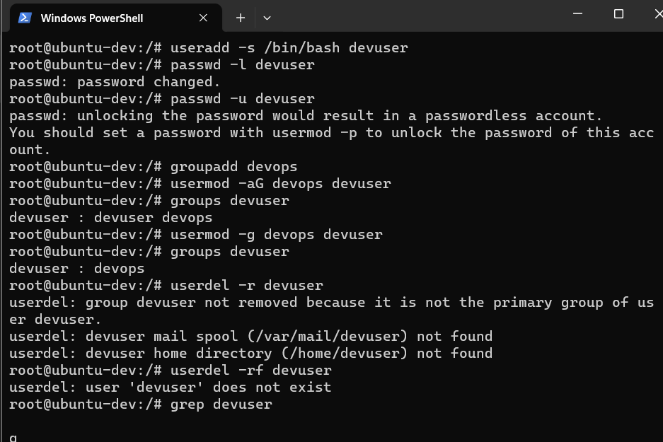
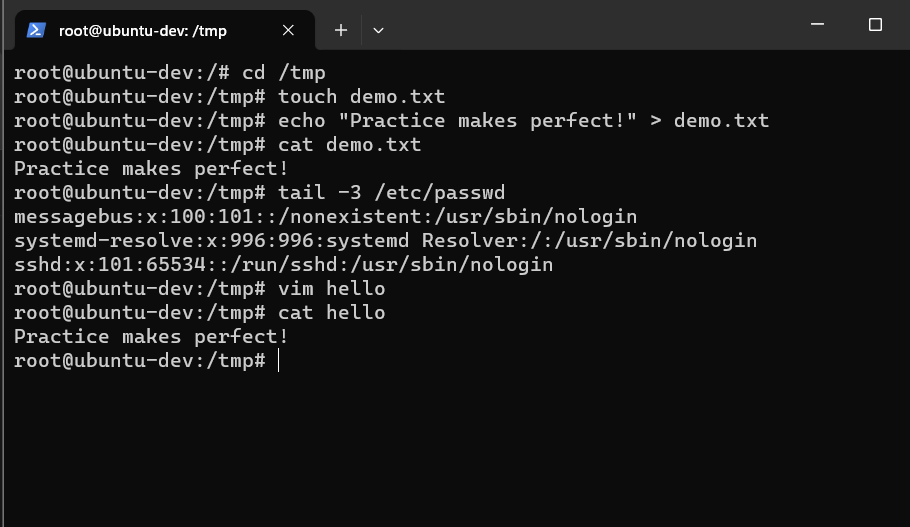

## 🧑‍💻 User Management
Linux is a multi-user system, so understanding user management is key for security and automation.

### 📌 Types of Users
- **Root User** → Superuser with all privileges
- **Normal Users** → Created for daily operations
- **System Users** → Created for running services/processes

### 👤 Creating Users
```bash
# Create user without home dir
sudo useradd prakash

# Create user with home directory
sudo useradd -m prakash

# Create user with custom shell
sudo useradd -m -s /bin/bash prakash

# Using adduser (Debian-based, interactive)
sudo adduser prakash
```

### 🔑 Password Management
```bash
sudo passwd prakash       # Set/change password
sudo passwd -l prakash    # Lock user
sudo passwd -u prakash    # Unlock user
```

### 🗑 Deleting Users
```bash
sudo userdel prakash        # Remove user (keeps home dir)
sudo userdel -r prakash     # Remove user + home dir
```

### 👥 Groups
```bash
sudo groupadd devops        # Create group
sudo groupdel devops        # Delete group
sudo usermod -aG devops prakash  # Add user to group
sudo usermod -g devops prakash   # Change primary group
groups prakash              # View user's groups
getent group                # List all groups
```

### 🛠 Non-Interactive Shell User
```bash
sudo useradd -s /usr/sbin/nologin deployuser
```
This creates a user who cannot log in interactively but can run automated tasks (useful for CI/CD).

### 🔑 Sudo Privileges
```bash
sudo usermod -aG sudo prakash   # Give sudo rights
```


## 🔗 SSH Client & Server

### SSH Client
Used to connect to remote servers:
```bash
ssh username@server-ip
```

### SSHD (SSH Daemon)
Runs on the server and listens for incoming SSH requests.
```bash
sudo service ssh start  # Start SSH service (on systemd)
```


## 📁 File Management
```bash
# Create files & folders
touch file1.txt
mkdir myfolder

# Copy/Move files
cp file1.txt file2.txt
mv file2.txt myfolder/

# Delete files & folders
rm file1.txt
rm -rf myfolder
```


## 📝 File Viewing & Editing
```bash
cat file.txt        # View file content
tac file.txt        # Reverse view
head -n 5 file.txt  # First 5 lines
tail -n 5 file.txt  # Last 5 lines
less file.txt       # Scrollable view
more file.txt       # Similar to less
echo "Hello" > file.txt    # Overwrite file
echo "World" >> file.txt   # Append to file
```


## ✍️ Vim Editor Basics
```bash
vim file.txt        # Open file in vim
```
### Modes:
- **Normal Mode** – Navigation (default)
- **Insert Mode** – Text editing (`i` to enter, `Esc` to exit)
- **Command Mode** – Save/quit commands (start with `:`)

### Essential Commands:
- `:w` → Save
- `:q` → Quit
- `:wq` → Save & Quit
- `:q!` → Quit without saving

### Navigation:
- `h` → Left | `l` → Right | `j` → Down | `k` → Up
- `gg` → Start of file | `G` → End of file

📸 **Screenshot:**



## 💡 Key Takeaways
✅ Hands-on with user management (create, modify, delete users & groups)
✅ Learned about SSH client/server & secure remote login
✅ Practiced file operations (create, copy, move, delete)
✅ Explored file viewing tools (cat, less, head, tail)
✅ Learned Vim editor modes & shortcuts


